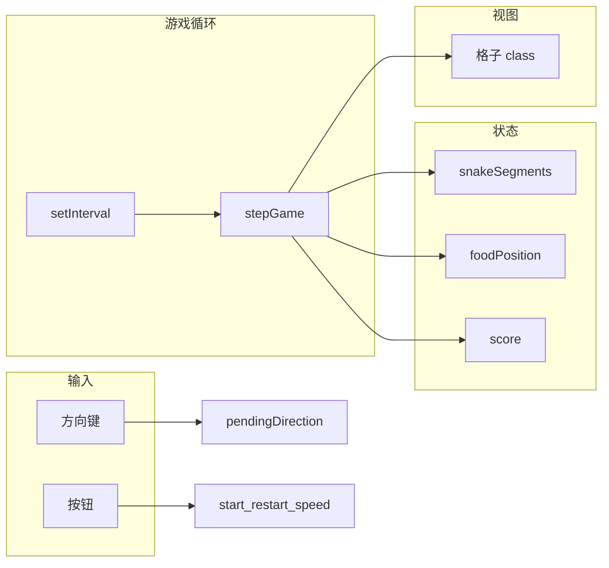

# 贪吃蛇（网页演示版）

原生 **HTML + CSS + JavaScript** 实现的 20×20 网格贪吃蛇，无构建步骤、无前端框架，适合培训演示。

---

## 依赖说明

| 说明 |
|------|
| 游戏本身 **不需要** Node.js、npm、Python、`pip` 或任何项目级依赖包。 |
| **Ubuntu 24.04 服务器** 上由一键脚本通过 `apt` 安装：**nginx**、**git**、**ca-certificates**、**curl**、**ufw**（可用 `--skip-ufw` 跳过防火墙）；若启用 HTTPS 会再装 **certbot**、**python3-certbot-nginx**。 |

---

## 代码架构

### 目录与文件职责

```
snake-game/
├── index.html              # 页面结构
├── style.css               # 布局与主题
├── script.js               # 游戏逻辑与渲染
├── scripts/
│   └── deploy-ubuntu.sh    # Ubuntu 24.04 一键部署
└── README.md
```

`index.html` 通过相对路径引用 `style.css`、`script.js`，须与二者同级。

### `script.js` 逻辑分层（自上而下）

1. **常量** — `GRID_SIZE`、`SPEED_PRESETS`、`INITIAL_SNAKE_LENGTH`、`INITIAL_DIRECTION`、`SNAKE_FACE_CLASSES`。
2. **DOM 引用** — 棋盘、分数、横幅、按钮。
3. **状态** — `snakeSegments`、`direction` / `pendingDirection`、`foodPosition`、`score`、`isRunning`、`tickTimerId`、`speedPresetIndex`。
4. **网格** — `buildGrid()`、`cellIndex()`。
5. **蛇与食物** — `resetSnakeToCenter()`、`spawnFood()`。
6. **输入** — `onKeyDown`。
7. **步进** — `stepGame()`（移动、碰撞、吃食物、`renderBoard()`）。
8. **渲染** — `clearCellClasses`、`renderBoard()`。
9. **生命周期** — `applyGameInterval`、`startGame`、`endGame`、`restartGame`、`initGame`。
10. **事件绑定** — 开始、重开、速度、加载时 `initGame()`。

### 数据流简图



---

## Ubuntu 24.04 部署（唯一方式）

在服务器上执行（会下载脚本并**自动安装**上述系统包、克隆站点、配置 Nginx、默认启用 UFW；**部署结束后终端只打印一行「访问链接」**）：

```bash
curl -fsSL https://raw.githubusercontent.com/dangleungfai/snake-game/main/scripts/deploy-ubuntu.sh -o deploy-ubuntu.sh
chmod +x deploy-ubuntu.sh
sudo ./deploy-ubuntu.sh
```

已克隆本仓库时也可：

```bash
sudo ./scripts/deploy-ubuntu.sh
```

**仅用云厂商安全组、不用本机 UFW 时：**

```bash
sudo ./deploy-ubuntu.sh --skip-ufw
```

**HTTPS（域名已解析到本机）：**

```bash
sudo ./deploy-ubuntu.sh --with-ssl --domain 你的域名 --email 你的邮箱
```

成功后请直接使用脚本输出的 **`访问链接: http://.../`** 或 **`https://.../`** 打开游戏。

---

## 操作说明（游戏内）

- **方向键**：移动；**慢 / 中 / 快**：调节速度。
- **开始游戏** / **重新开始**：开局或重置后开局。

---

## 许可证

若仓库未特别声明，以仓库所有者选择为准。
