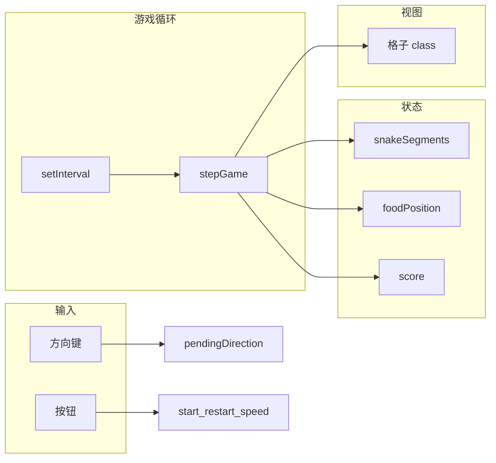

# 贪吃蛇（网页演示版）

原生 **HTML + CSS + JavaScript** 实现的 20×20 网格贪吃蛇，无构建步骤、无前端框架，适合培训演示与静态托管。

---

## 依赖说明（重要）

| 类型 | 是否需要 | 说明 |
|------|----------|------|
| **npm / Node.js** | **不需要** | 无 `package.json`，不安装任何 npm 包 |
| **Python** | 可选 | 仅在使用「本地静态服务器」方式时，若系统已自带 `python3` 可直接用 |
| **Git** | 可选 | 克隆仓库或推送到 GitHub 时使用 |

**结论：** 本地用浏览器直接打开 `index.html` 时，**无需执行任何安装依赖的命令**。

---

## 代码架构

### 目录与文件职责

```
snake-game/
├── index.html    # 页面结构：标题、分数、速度按钮、开始/重新开始、游戏结束提示、棋盘容器
├── style.css     # 布局与主题：居中面板、20×20 网格、蛇身/蛇头（含朝向与五官）、食物、按钮状态
├── script.js     # 游戏状态机、定时步进、键盘输入、DOM 渲染
└── README.md     # 本说明文档
```

三者通过相对路径引用（`href="style.css"`、`src="script.js"`），须保持与 `index.html` **同级目录**，否则打开页面会丢样式或脚本。

### `script.js` 逻辑分层（自上而下）

1. **常量** — `GRID_SIZE`、`SPEED_PRESETS`（慢/中/快的步进间隔 ms）、`INITIAL_SNAKE_LENGTH`、`INITIAL_DIRECTION`、`SNAKE_FACE_CLASSES`（蛇头朝向对应的 CSS class 列表，用于清理 DOM）。
2. **DOM 引用** — 棋盘、分数、结束横幅、开始/重新开始、速度按钮组。
3. **可变状态** — `snakeSegments`（蛇身坐标数组，索引 0 为头）、`direction` / `pendingDirection`（防同帧反向）、`foodPosition`、`score`、`isRunning`、`tickTimerId`、`speedPresetIndex`。
4. **网格** — `buildGrid()` 生成 400 个格子；`cellIndex(col, row)` 映射二维坐标到一维 `cellElements`。
5. **初始化蛇与食物** — `resetSnakeToCenter()`、`spawnFood()`（避开蛇身随机落点）。
6. **输入** — `onKeyDown` 更新 `pendingDirection`（运行中且非反向时）。
7. **单步规则** — `stepGame()`：移动头部 → 撞墙/撞身则 `endGame()` → 否则更新蛇身；吃到食物加分并重新 `spawnFood()`，否则去尾；最后 `renderBoard()`。
8. **渲染** — `clearCellClasses` / `renderBoard()`：按状态给格子切换 `snake` / `head` / `face-*` / `food` 等 class。
9. **生命周期** — `stopTick`、`applyGameInterval`（按当前速度重建 `setInterval`）、`startGame`、`endGame`、`restartGame`、`initGame`。
10. **事件** — 开始、重新开始、速度档位点击；页面加载执行 `initGame()`。

### 数据流简图



---

## 部署步骤

以下任选一种即可；**不需要**先运行 `npm install`。

### 方式 A：本机直接用浏览器打开（最简单）

1. 将仓库放到本机任意目录（或只复制三个文件 `index.html`、`style.css`、`script.js` 到同一文件夹）。
2. 双击 `index.html`，或用浏览器「打开文件」选择该文件。

**执行的命令（可选，macOS 用默认浏览器打开）：**

```bash
cd /path/to/snake-game
open index.html
```

**Linux（示例）：**

```bash
cd /path/to/snake-game
xdg-open index.html
```

**Windows（PowerShell 示例）：**

```powershell
cd C:\path\to\snake-game
start index.html
```

> 说明：个别浏览器对 `file://` 策略较严，若出现异常可改用方式 B。

---

### 方式 B：本地静态 HTTP 服务（推荐开发与联调）

在**项目根目录**（与 `index.html` 同级）启动只读静态服务，浏览器访问 `http://localhost:端口`。

#### B1：Python 3（系统常见自带，**不通过 pip 安装项目依赖**）

```bash
cd /path/to/snake-game
python3 -m http.server 8080
```

浏览器打开：`http://127.0.0.1:8080/` ，点击 `index.html` 或访问 `http://127.0.0.1:8080/index.html`。

停止服务：终端中按 `Ctrl+C`。

#### B2：Node.js 的 `npx`（仅当本机已安装 Node 时使用，**全局无需为本项目装包**）

```bash
cd /path/to/snake-game
npx --yes serve -l 3000
```

按终端提示打开对应本地 URL（一般为 `http://localhost:3000`）。

> `npx` 会临时拉取 `serve` 工具，**不属于本仓库的 package 依赖**；若不想用 npx，可只用 Python 方式。

---

### 方式 C：GitHub Pages（免费托管静态站）

1. 将本仓库推送到 GitHub（你已有远程示例）：

   ```bash
   cd /path/to/snake-game
   git remote add origin git@github.com:YOUR_USER/snake-game.git
   git branch -M main
   git push -u origin main
   ```

2. 在 GitHub 网页：**仓库 → Settings → Pages**。
3. **Build and deployment**：Source 选 **Deploy from a branch**；Branch 选 **`main`**，文件夹选 **`/ (root)`**，保存。
4. 等待几分钟后，通过站点地址访问（形如 `https://YOUR_USER.github.io/snake-game/` 或 GitHub 提示的 URL）。

**无需安装依赖**；构建步骤为「无」，仅托管静态文件。

---

### 方式 D：自有服务器（Nginx 示例）

1. 将 `index.html`、`style.css`、`script.js` 拷贝到服务器目录，例如 `/var/www/snake-game/`。
2. Nginx 配置片段示例：

   ```nginx
   server {
       listen 80;
       server_name your.domain.example;
       root /var/www/snake-game;
       index index.html;
       location / {
           try_files $uri $uri/ =404;
       }
   }
   ```

3. 检查配置并重载（命令因系统略有差异，**以下为常见 Linux 示例**）：

   ```bash
   sudo nginx -t
   sudo systemctl reload nginx
   ```

**无需**在服务器上安装 Node/npm 即可运行本游戏。

---

## 克隆仓库与更新代码（Git 命令参考）

```bash
git clone git@github.com:dangleungfai/snake-game.git
cd snake-game
```

修改后提交并推送：

```bash
git add index.html style.css script.js README.md
git commit -m "docs: 更新说明"
git push origin main
```

---

## 操作说明（游戏内）

- **方向键**：控制移动；游戏中切换 **慢 / 中 / 快** 可立即改变步进间隔。
- **开始游戏**：首次开始；上一局结束后也可点（会先重置再开局）。
- **重新开始**：分数与蛇身重置并立即开局。

---

## 许可证

若仓库未特别声明，默认以仓库所有者选择为准；教学演示可自行标注用途。
