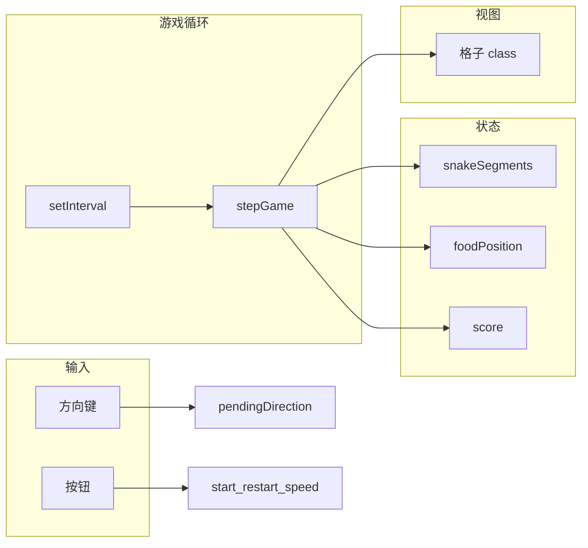

# 贪吃蛇（网页演示版）

原生 **HTML + CSS + JavaScript** 实现的 20×20 网格贪吃蛇，无构建步骤、无前端框架，适合培训演示与静态托管。

---

## 依赖说明（重要）

| 类型 | 是否需要 | 说明 |
|------|----------|------|
| **npm / Node.js** | **不需要** | 无 `package.json`，不安装任何 npm 包 |
| **Python** | 可选 | 仅在使用「本地静态服务器」方式时，若系统已自带 `python3` 可直接用 |
| **Git** | 可选 | 克隆仓库或推送到 GitHub 时使用 |

**结论：** 本地用浏览器直接打开 `index.html` 时，**无需执行任何安装依赖的命令**。

**部署到 Ubuntu 24.04 服务器时：** 游戏本身仍无 npm/pip 依赖；对外提供服务通常只需通过 `apt` 安装 **Nginx**（可选 **Git**、**Certbot** 等），详见下文 **「方式 D：Ubuntu 24.04 服务器 + Nginx」**。

---

## 代码架构

### 目录与文件职责

```
snake-game/
├── index.html              # 页面结构：标题、分数、速度按钮、开始/重新开始、游戏结束提示、棋盘容器
├── style.css               # 布局与主题：居中面板、20×20 网格、蛇身/蛇头（含朝向与五官）、食物、按钮状态
├── script.js               # 游戏状态机、定时步进、键盘输入、DOM 渲染
├── scripts/
│   └── deploy-ubuntu.sh    # Ubuntu 一键部署：apt 安装 Nginx/Git 等，克隆/更新代码并配置站点
└── README.md               # 本说明文档
```

三者通过相对路径引用（`href="style.css"`、`src="script.js"`），须保持与 `index.html` **同级目录**，否则打开页面会丢样式或脚本。

### `script.js` 逻辑分层（自上而下）

1. **常量** — `GRID_SIZE`、`SPEED_PRESETS`（慢/中/快的步进间隔 ms）、`INITIAL_SNAKE_LENGTH`、`INITIAL_DIRECTION`、`SNAKE_FACE_CLASSES`（蛇头朝向对应的 CSS class 列表，用于清理 DOM）。
2. **DOM 引用** — 棋盘、分数、结束横幅、开始/重新开始、速度按钮组。
3. **可变状态** — `snakeSegments`（蛇身坐标数组，索引 0 为头）、`direction` / `pendingDirection`（防同帧反向）、`foodPosition`、`score`、`isRunning`、`tickTimerId`、`speedPresetIndex`。
4. **网格** — `buildGrid()` 生成 400 个格子；`cellIndex(col, row)` 映射二维坐标到一维 `cellElements`。
5. **初始化蛇与食物** — `resetSnakeToCenter()`、`spawnFood()`（避开蛇身随机落点）。
6. **输入** — `onKeyDown` 更新 `pendingDirection`（运行中且非反向时）。
7. **单步规则** — `stepGame()`：移动头部 → 撞墙/撞身则 `endGame()` → 否则更新蛇身；吃到食物加分并重新 `spawnFood()`，否则去尾；最后 `renderBoard()`。
8. **渲染** — `clearCellClasses` / `renderBoard()`：按状态给格子切换 `snake` / `head` / `face-*` / `food` 等 class。
9. **生命周期** — `stopTick`、`applyGameInterval`（按当前速度重建 `setInterval`）、`startGame`、`endGame`、`restartGame`、`initGame`。
10. **事件** — 开始、重新开始、速度档位点击；页面加载执行 `initGame()`。

### 数据流简图



---

## 部署步骤

以下任选一种即可；**不需要**先运行 `npm install`。

### 方式 A：本机直接用浏览器打开（最简单）

1. 将仓库放到本机任意目录（或只复制三个文件 `index.html`、`style.css`、`script.js` 到同一文件夹）。
2. 双击 `index.html`，或用浏览器「打开文件」选择该文件。

**执行的命令（可选，macOS 用默认浏览器打开）：**

```bash
cd /path/to/snake-game
open index.html
```

**Linux（示例）：**

```bash
cd /path/to/snake-game
xdg-open index.html
```

**Windows（PowerShell 示例）：**

```powershell
cd C:\path\to\snake-game
start index.html
```

> 说明：个别浏览器对 `file://` 策略较严，若出现异常可改用方式 B。

---

### 方式 B：本地静态 HTTP 服务（推荐开发与联调）

在**项目根目录**（与 `index.html` 同级）启动只读静态服务，浏览器访问 `http://localhost:端口`。

#### B1：Python 3（系统常见自带，**不通过 pip 安装项目依赖**）

```bash
cd /path/to/snake-game
python3 -m http.server 8080
```

浏览器打开：`http://127.0.0.1:8080/` ，点击 `index.html` 或访问 `http://127.0.0.1:8080/index.html`。

停止服务：终端中按 `Ctrl+C`。

#### B2：Node.js 的 `npx`（仅当本机已安装 Node 时使用，**全局无需为本项目装包**）

```bash
cd /path/to/snake-game
npx --yes serve -l 3000
```

按终端提示打开对应本地 URL（一般为 `http://localhost:3000`）。

> `npx` 会临时拉取 `serve` 工具，**不属于本仓库的 package 依赖**；若不想用 npx，可只用 Python 方式。

---

### 方式 C：GitHub Pages（免费托管静态站）

1. 将本仓库推送到 GitHub（你已有远程示例）：

   ```bash
   cd /path/to/snake-game
   git remote add origin git@github.com:YOUR_USER/snake-game.git
   git branch -M main
   git push -u origin main
   ```

2. 在 GitHub 网页：**仓库 → Settings → Pages**。
3. **Build and deployment**：Source 选 **Deploy from a branch**；Branch 选 **`main`**，文件夹选 **`/ (root)`**，保存。
4. 等待几分钟后，通过站点地址访问（形如 `https://YOUR_USER.github.io/snake-game/` 或 GitHub 提示的 URL）。

**无需安装依赖**；构建步骤为「无」，仅托管静态文件。

---

### 方式 D：Ubuntu 24.04 服务器 + Nginx

本游戏是纯静态资源，**不需要**安装 Node.js、npm、Python 运行时或任何项目级包；在服务器上只需一个 **Web 服务器**（下文用 **Nginx**）。

#### D0：需要安装的软件（依赖一览）

| 软件 | 是否必须 | 用途 |
|------|----------|------|
| **nginx** | **推荐必装** | 对外提供 HTTP，托管 `index.html` / `style.css` / `script.js` |
| **git** | 可选 | 在服务器上 `git clone` 拉代码时用 |
| **ufw** | 可选 | Ubuntu 通常已带；用于放行 22/80 端口 |
| **certbot** + **python3-certbot-nginx** | 可选 | 配置 HTTPS（Let’s Encrypt）时用 |

**不需要安装：** `nodejs`、`npm`、`python3-pip`、本项目无任何 `apt install` 级别的「应用依赖包」。

#### D0.5：一键部署脚本（推荐）

仓库内 **`scripts/deploy-ubuntu.sh`** 会在 **Ubuntu 20.04+ / 24.04** 上自动执行：

| 步骤 | 说明 |
|------|------|
| `apt-get update` | 更新软件源索引 |
| `apt-get install -y nginx git ca-certificates` | 安装 Web 服务器、克隆仓库用的 Git、HTTPS 校验根证书 |
| `git clone` 或 `git pull` | 将站点文件放到 `/var/www/snake-game`（可用参数修改） |
| 写入 `sites-available`、启用站点、禁用默认站点 | 配置 Nginx 并 `nginx -t` + `reload` |
| 可选 `--with-ufw` | 额外执行 `apt install ufw` 并放行 SSH / HTTP(/HTTPS) |
| 可选 `--with-ssl` | 额外执行 `apt install certbot python3-certbot-nginx` 并申请 Let’s Encrypt |

**在服务器上执行（已克隆本仓库时）：**

```bash
cd /path/to/snake-game
chmod +x scripts/deploy-ubuntu.sh
sudo ./scripts/deploy-ubuntu.sh
```

**带防火墙（首次部署云服务器常用）：**

```bash
sudo ./scripts/deploy-ubuntu.sh --with-ufw
```

**HTTPS（需域名已解析到本机，并填写邮箱）：**

```bash
sudo ./scripts/deploy-ubuntu.sh --with-ufw --with-ssl --domain game.example.com --email you@example.com
```

**不克隆、只下载脚本后执行（将 `YOUR_USER` 换成你的 GitHub 用户名，或保持官方仓库地址）：**

```bash
curl -fsSL https://raw.githubusercontent.com/dangleungfai/snake-game/main/scripts/deploy-ubuntu.sh -o deploy-ubuntu.sh
chmod +x deploy-ubuntu.sh
sudo ./deploy-ubuntu.sh
```

> **说明：** 脚本只负责在**服务器上**安装系统包并拉取/更新代码；**向 GitHub 推送代码**仍需在开发机上使用 `git push`（见文末「克隆仓库与更新代码」），不要把服务器 SSH 密钥误用在脚本里自动推送。

#### D1：更新软件源并安装 Nginx（在服务器上执行）

使用 SSH 登录 Ubuntu 24.04 后：

```bash
sudo apt update
sudo apt install -y nginx
```

确认服务已启用并运行：

```bash
sudo systemctl enable nginx
sudo systemctl start nginx
sudo systemctl status nginx --no-pager
```

浏览器访问 `http://服务器公网IP` 应看到 Nginx 默认欢迎页（说明 80 端口已通）。

#### D2：（可选）安装 Git，用于在服务器上克隆仓库

若不用 Git，可改用 `scp`/`rsync` 上传三个静态文件，可跳过本节。

```bash
sudo apt install -y git
```

克隆示例（将仓库地址换成你的）：

```bash
sudo mkdir -p /var/www
cd /var/www
sudo git clone https://github.com/dangleungfai/snake-game.git
```

#### D3：准备站点目录与文件权限

**若已用 Git 克隆到 `/var/www/snake-game`**，确保站点根目录下至少有：`index.html`、`style.css`、`script.js`。

**若手动上传文件**，可先建目录再拷贝：

```bash
sudo mkdir -p /var/www/snake-game
# 在本地电脑执行（示例）：将三个文件拷到服务器
# scp index.html style.css script.js user@服务器IP:/tmp/
# 然后在服务器上：
sudo mv /tmp/index.html /tmp/style.css /tmp/script.js /var/www/snake-game/
```

将目录所有者设为 Nginx 进程用户（Ubuntu 上一般为 `www-data`），避免权限问题：

```bash
sudo chown -R www-data:www-data /var/www/snake-game
sudo chmod -R u=rwX,g=rX,o=rX /var/www/snake-game
```

#### D4：新建 Nginx 站点配置

创建配置文件（文件名可自定，例如 `snake-game`）：

```bash
sudo nano /etc/nginx/sites-available/snake-game
```

写入以下内容（**把 `server_name` 改成你的域名或服务器 IP**；若暂时没有域名，可写 `_` 或本机 IP）：

```nginx
server {
    listen 80;
    listen [::]:80;
    server_name your.domain.example;

    root /var/www/snake-game;
    index index.html;

    location / {
        try_files $uri $uri/ =404;
    }
}
```

启用站点并禁用默认站点（可选，避免抢默认 `server`）：

```bash
sudo ln -sf /etc/nginx/sites-available/snake-game /etc/nginx/sites-enabled/
sudo rm -f /etc/nginx/sites-enabled/default
```

校验配置并重载 Nginx：

```bash
sudo nginx -t
sudo systemctl reload nginx
```

此时用浏览器访问 `http://你的域名或IP/` 应能打开贪吃蛇页面。

#### D5：（可选）防火墙 UFW

若已启用 UFW，需放行 SSH 与 HTTP（HTTPS 若后续配置再放行 443）：

```bash
sudo apt install -y ufw
sudo ufw allow OpenSSH
sudo ufw allow 'Nginx HTTP'
sudo ufw enable
sudo ufw status
```

#### D6：（可选）HTTPS：安装 Certbot 并申请证书

**前提：** 域名已解析到该服务器公网 IP。

```bash
sudo apt install -y certbot python3-certbot-nginx
sudo certbot --nginx -d your.domain.example
```

按提示完成验证；Certbot 会自动修改 Nginx 配置。证书续期由系统定时任务处理，可手动测试：

```bash
sudo certbot renew --dry-run
```

#### D7：仅用 Python 临时验证（不推荐生产环境）

Ubuntu 24.04 默认带 **Python 3**，**无需 `pip install` 任何包**。仅作联调时可在项目目录执行：

```bash
cd /var/www/snake-game
python3 -m http.server 8080 --bind 0.0.0.0
```

需在防火墙放行 `8080`，且生产环境请改用 Nginx。

---

## 克隆仓库与更新代码（Git 命令参考）

```bash
git clone git@github.com:dangleungfai/snake-game.git
cd snake-game
```

修改后提交并推送：

```bash
git add index.html style.css script.js README.md scripts/deploy-ubuntu.sh
git commit -m "docs: 更新说明"
git push origin main
```

---

## 操作说明（游戏内）

- **方向键**：控制移动；游戏中切换 **慢 / 中 / 快** 可立即改变步进间隔。
- **开始游戏**：首次开始；上一局结束后也可点（会先重置再开局）。
- **重新开始**：分数与蛇身重置并立即开局。

---

## 许可证

若仓库未特别声明，默认以仓库所有者选择为准；教学演示可自行标注用途。
